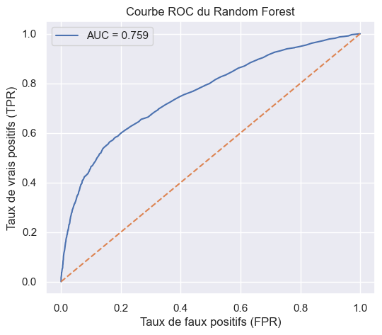

# Modélisation du risque de défaut de paiement par apprentissage automatique
*(English version below)*

## Objectif du projet

Ce projet vise à prédire le risque de défaut de paiement des titulaires de cartes de crédit à l’aide de techniques de science des données et d’apprentissage automatique.

L’objectif est d’identifier les variables financières et comportementales les plus pertinentes afin de modéliser la probabilité de défaut le mois suivant.

## Jeu de données

- Nom : Default of Credit Card Clients  
- Source : Kaggle  
- Taille : 30 000 observations  
- Variables : 25 variables financières, démographiques et comportementales  

## Outils et technologies utilisés

- Python
- Pandas et NumPy (manipulation des données)
- Matplotlib et Seaborn (visualisation)
- Scikit-learn (modélisation prédictive)
- Jupyter Notebook (via Visual Studio Code)
- Git et GitHub (gestion de version)

## Méthodologie

- Nettoyage et préparation des données  
- Analyse exploratoire des données (EDA)  
- Sélection des variables  
- Modélisation prédictive (régression logistique, forêt aléatoire)  
- Évaluation des performances (courbe ROC, accuracy, précision)  

## Résultats

- Identification des variables influençant le risque de défaut  
- Modèles capables de prédire efficacement le défaut de paiement  
- Analyse de la performance à l’aide de la courbe ROC

## Performance du modèle

## Variables les plus importantes

L’analyse des modèles a permis d’identifier plusieurs variables clés influençant le risque de défaut de paiement :

- Le montant des paiements récents (PAY_AMT)  
- Le statut de remboursement (historique de paiement)  
- Le niveau d’utilisation du crédit (BILL_AMT)  
- Le comportement de paiement au cours des derniers mois  

Ces variables reflètent directement la capacité et le comportement de remboursement des clients.

## Valeur métier

Ce projet permet d’illustrer l’application de la science des données à la gestion du risque de crédit.

Les résultats peuvent être utilisés pour :

- Améliorer la détection des clients à risque  
- Optimiser les décisions d’octroi de crédit  
- Réduire les pertes financières liées aux défauts de paiement  
- Mettre en place des stratégies de gestion du risque plus efficaces  

Ce type de modèle est directement applicable dans les secteurs bancaire et financier.

## Contexte

Ce projet a été réalisé dans le cadre d’un certificat universitaire en science des données.

## État du projet

Projet terminé  
Note maximale obtenue  
Cours complété  

# Credit Default Risk Modeling Using Machine Learning

## Project Objective

This project aims to predict the risk of credit card default using data science and machine learning techniques.

The objective is to identify the most relevant financial and behavioral variables in order to model the probability of default in the following month.

## Dataset

- Name: Default of Credit Card Clients  
- Source: Kaggle  
- Size: 30,000 observations  
- Features: 25 financial, demographic, and behavioral variables  

## Tools and Technologies

- Python  
- Pandas and NumPy (data manipulation)  
- Matplotlib and Seaborn (data visualization)  
- Scikit-learn (predictive modeling)  
- Jupyter Notebook (via Visual Studio Code)  
- Git and GitHub (version control)  

## Methodology

- Data cleaning and preprocessing  
- Exploratory Data Analysis (EDA)  
- Feature selection  
- Predictive modeling (Logistic Regression, Random Forest)  
- Model evaluation (ROC curve, accuracy, precision)  

## Results

- Identification of key variables influencing default risk  
- Models capable of effectively predicting credit default  
- Performance analysis using ROC curve  

## Key Features Influencing Default Risk

The modeling process highlighted several key variables that strongly influence credit default risk:

- Recent payment amounts (PAY_AMT)  
- Repayment status (payment history)  
- Credit utilization level (BILL_AMT)  
- Payment behavior over recent months  

These variables directly reflect the customer’s repayment capacity and behavior.

## Model Performance

## Business Value

This project demonstrates the application of data science to credit risk management.

The results can be used to:

- Improve the identification of high-risk customers  
- Support credit approval decision-making  
- Reduce financial losses related to defaults  
- Develop more effective risk management strategies  

This type of model is directly applicable in banking and financial institutions.

## Background

This project was completed as part of a university-level data science certificate program.

## Project Status

Project completed  
Highest grade achieved  
Course completed  
